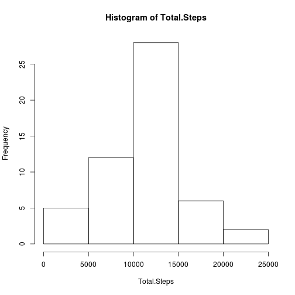
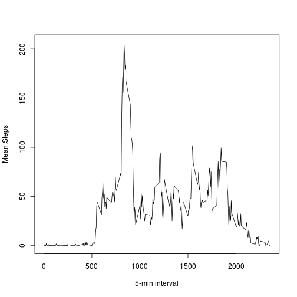
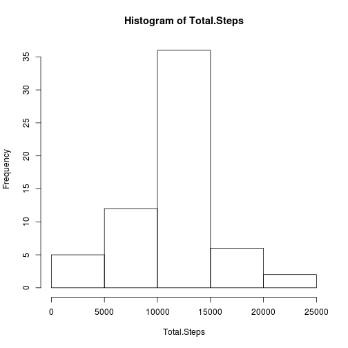
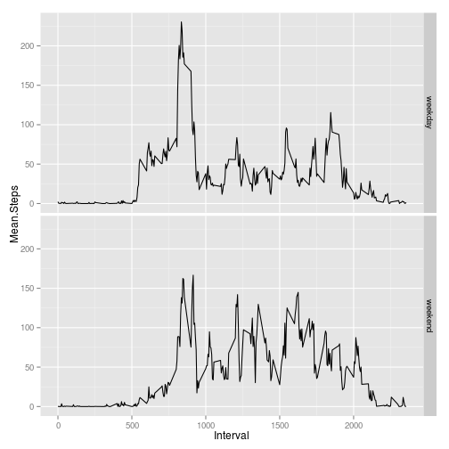

First load the plyr package for data manipulation and ggplot2 for panel plotting.


```r
library(plyr)
library(ggplot2)
```

## Loading and preprocessing the data

Then unzip and load the activity data.


```r
if (!file.exists('activity.csv')) { unzip('activity.zip'); print("apa") }
activity <- read.csv('activity.csv', header = T, col.names = c("Steps", "Date", "Interval"))
```

Finally convert date string to dates.


```r
activity$Date <- as.Date(activity$Date)
```

Here's a summaty of the resulting data frame.


```r
str(activity)
```

```
## 'data.frame':	17568 obs. of  3 variables:
##  $ Steps   : int  NA NA NA NA NA NA NA NA NA NA ...
##  $ Date    : Date, format: "2012-10-01" "2012-10-01" ...
##  $ Interval: int  0 5 10 15 20 25 30 35 40 45 ...
```

```r
summary(activity)
```

```
##      Steps             Date               Interval     
##  Min.   :  0.00   Min.   :2012-10-01   Min.   :   0.0  
##  1st Qu.:  0.00   1st Qu.:2012-10-16   1st Qu.: 588.8  
##  Median :  0.00   Median :2012-10-31   Median :1177.5  
##  Mean   : 37.38   Mean   :2012-10-31   Mean   :1177.5  
##  3rd Qu.: 12.00   3rd Qu.:2012-11-15   3rd Qu.:1766.2  
##  Max.   :806.00   Max.   :2012-11-30   Max.   :2355.0  
##  NA's   :2304
```

## What is mean total number of steps taken per day?

We can group activity by date and make a histogram of the total number of steps taken each day.


```r
activity.by.day <- ddply(activity, "Date", summarise, Total.Steps = sum(Steps))
steps.histogram <- with(activity.by.day, hist(Total.Steps))
```

 

The mean and median of the total number of steps taken per day (ignoring missing values) is calculated from `activity.by.day`.


```r
mean.steps <- mean(activity.by.day$Total.Steps, na.rm = T)
median.steps <- median(activity.by.day$Total.Steps, na.rm = T)
```

The mean and median of the total number of steps is 1.0766189 &times; 10<sup>4</sup> and 10765, respectively.

## What is the average daily activity pattern?

We can also group activity by 5-minute interval and take the average number of steps across all days. We plot this as a time-series (type = "l").


```r
activity.by.interval <- ddply(activity, "Interval", summarise, Mean.Steps = mean(Steps, na.rm = T))
plot(activity.by.interval, type = "l", xlab = "5-min interval")
```

 

There is a peak in the morning.


```r
peak.time <- with(activity.by.interval, Interval[which.max(Mean.Steps)])
```

In particular, the 5-minute interval starting at 835 contains the maximum number of steps (on average across all the days in the dataset).

## Imputing missing values

Note that there are a number of days/intervals where there are missing values (coded as NA). The presence of missing days may introduce bias into some calculations or summaries of the data. The total number of rows with at least one NAs is computed by `complete.cases` as follows.


```r
sum(!complete.cases(activity))
```

```
## [1] 2304
```

This could also be seen above, in the output of `summary(activity)`.


```r
tail(summary(activity), 1)
```

```
##      Steps             Date    Interval
##  "NA's   :2304  " NA        NA
```

Our strategy will be to replace all missing values (Steps) in the dataset using the mean for the 5-minute interval over all days.

We create a new data frame where we use the computed means for the 5-minute intervals over all days and replace the NAs in `activity` with these means.


```r
steps.or.mean.steps <- with(activity, replace(Steps, is.na(Steps), activity.by.interval$Mean.Steps))
filled.activity <- with(activity, data.frame(Steps = steps.or.mean.steps, Date = Date, Interval = Interval))
```

We also need to consider the impact of the imputed values. We make a histogram of the total number of steps taken each day and calculate the mean and median of the total number of steps taken per day as above.


```r
filled.activity.by.day <- ddply(filled.activity, "Date", summarise, Total.Steps = sum(Steps))
filled.steps.histogram <- with(filled.activity.by.day, hist(Total.Steps))
```

 

```r
filled.mean.steps <- mean(filled.activity.by.day$Total.Steps, na.rm = T)
filled.median.steps <- median(filled.activity.by.day$Total.Steps, na.rm = T)
```

This histogram looks similar to the one above. Indeed, the bins are the same and the counts for all non-center bins are the same.


```r
all(steps.histogram$breaks == filled.steps.histogram$breaks)
```

```
## [1] TRUE
```

```r
filled.steps.histogram$counts - steps.histogram$counts
```

```
## [1] 0 0 8 0 0
```

We also compare the means.


```r
mean.steps - filled.mean.steps
```

```
## [1] 0
```

```r
median.steps - filled.median.steps
```

```
## [1] -1.188679
```

The comparisson of the data frame with imputed missing values and the above data frame with missing values shows that:

* The histogram gets more mass in the center (8 new observations).
* Means DO NOT differ (by construction).
* Medians are very close.

In summary:

    The impact of imputing missing data on the estimates of the total daily number of steps is that the distribution becomes more centered since the new values end up at the mean.

## Are there differences in activity patterns between weekdays and weekends?

We group our data by weekday.


```r
Sys.setlocale("LC_TIME", "en_US.UTF-8")
```

```
## [1] "en_US.UTF-8"
```

```r
weekday.type <- factor(weekdays(filled.activity$Date) %in% c("Saturday", "Sunday"), labels = c("weekday", "weekend"))
activity.by.daytype <- with(filled.activity, data.frame(Steps = Steps, Weekend = weekday.type, Interval = Interval))
weekend.activity <- ddply(activity.by.daytype, c("Weekend", "Interval"), summarise, Mean.Steps = mean(Steps))
```

A panel plot indicates that activity seems to be slightly shifted towards later in the day.


```r
ggplot(weekend.activity, aes(Interval, Mean.Steps)) + geom_line() + facet_grid(Weekend ~ .)
```

 

The overall total activity is also higher on weekends.


```r
ddply(weekend.activity, "Weekend", summarise, Total.Activity = sum(Mean.Steps))
```

```
##   Weekend Total.Activity
## 1 weekday       10255.85
## 2 weekend       12201.52
```
